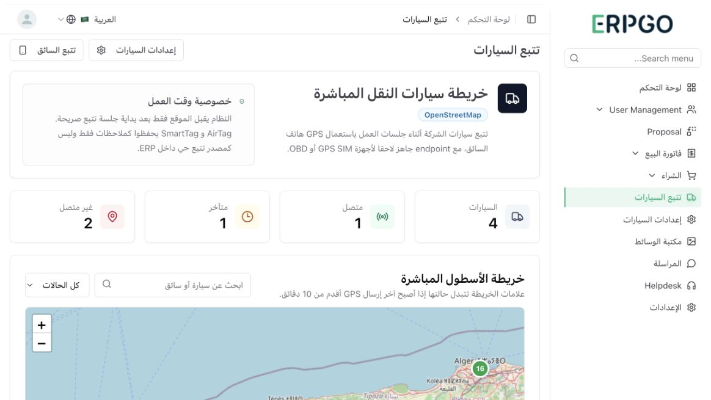
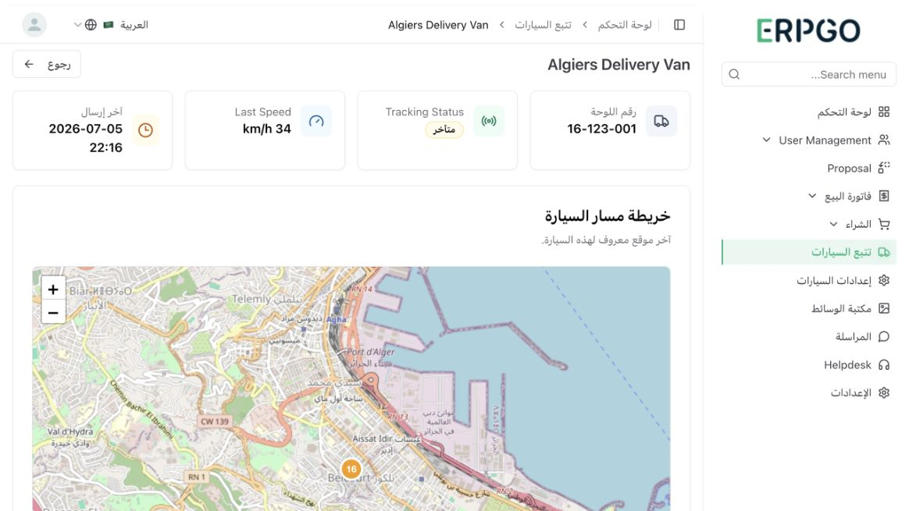
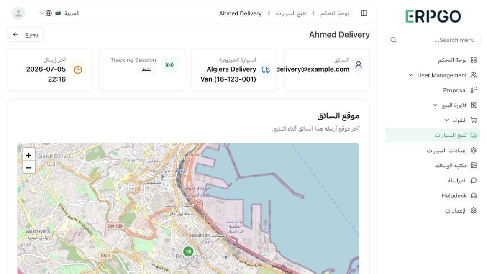
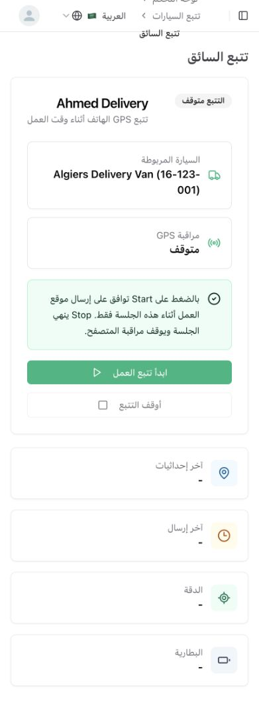
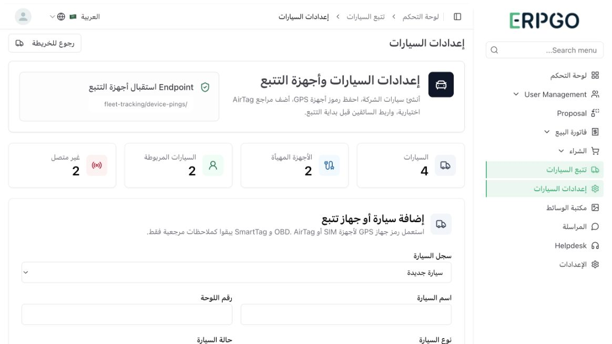

# Fleet Tracking Screenshots

تم التقاط هذه الصور من موديول تتبع سيارات النقل بعد تفعيله محليا. صور الإدارة من حساب الشركة، أما لقطة الموبايل فهي من حساب السائق Ahmed Delivery المرتبط فعليا بسيارة Algiers Delivery Van.

## 1. لوحة تتبع السيارات

تعرض خريطة OpenStreetMap/Leaflet، ملخص الحالات، الفلاتر، وسجل الحركة فقط. إدارة السيارات والأجهزة تكون من صفحة الإعدادات حتى تبقى لوحة المتابعة نظيفة.

## 2. تفاصيل السيارة

تعرض حالة السيارة، آخر إرسال GPS، الخريطة، السائق الحالي، ومصدر التتبع.

## 3. تفاصيل السائق

تعرض السيارة المربوطة بالسائق، جلسة التتبع الحالية، آخر موقع، وسجل النشاط القابل للتمرير.

## 4. صفحة التتبع من الهاتف

تعرض واجهة السائق Ahmed Delivery على قياس موبايل، والسيارة المربوطة به Algiers Delivery Van (16-123-001)، مع زر بداية/إيقاف التتبع وتنبيه الموافقة على إرسال الموقع أثناء جلسة العمل فقط.

## 5. إعدادات السيارات وأجهزة التتبع

تعرض مكان إضافة سيارة جديدة أو جهاز GPS/SIM/OBD، حفظ token الجهاز، إضافة مرجع AirTag/SmartTag، وربط السائق بالسيارة.

## 6. تعديل سيارة أو جهاز موجود

تعرض اختيار سيارة موجودة وتحديث بياناتها أو تبديل جهاز GPS. إذا تركت token فارغا أثناء التعديل يبقى token القديم محفوظا.

