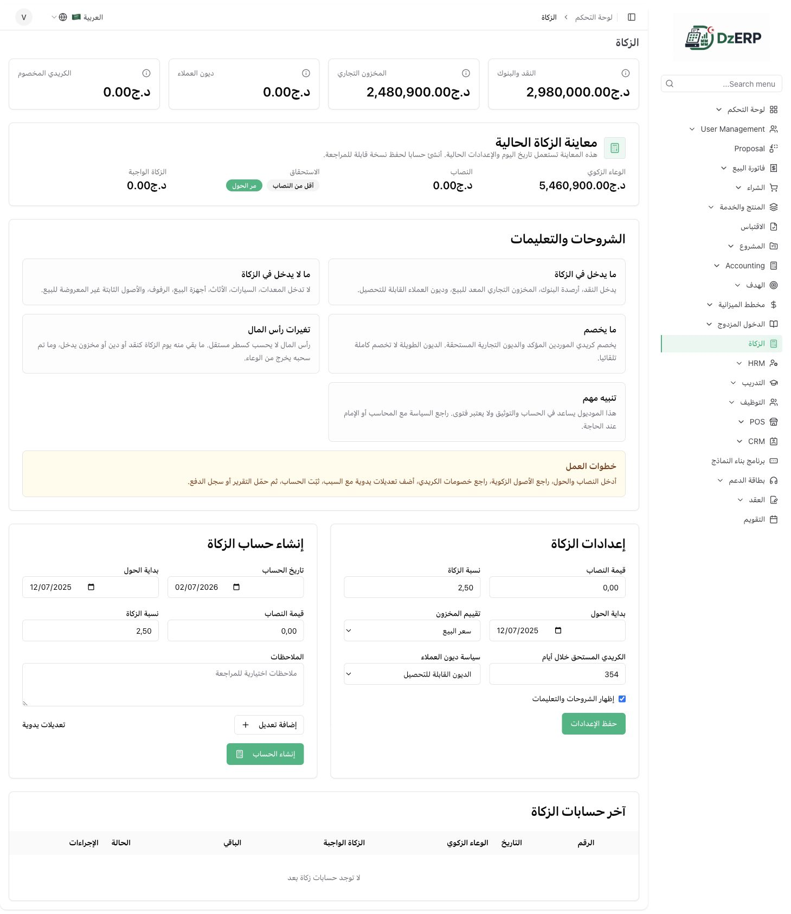
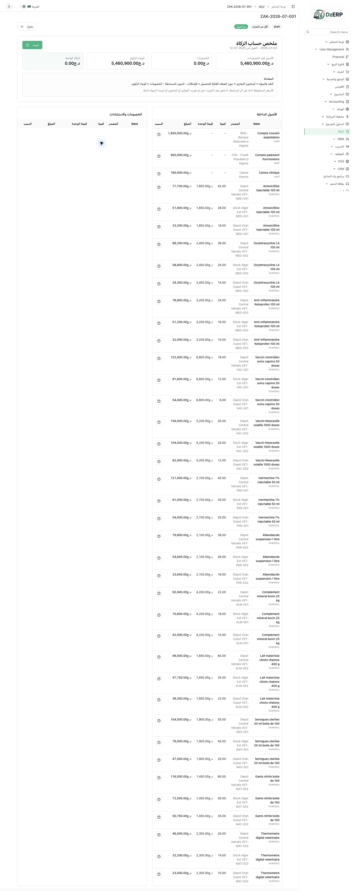
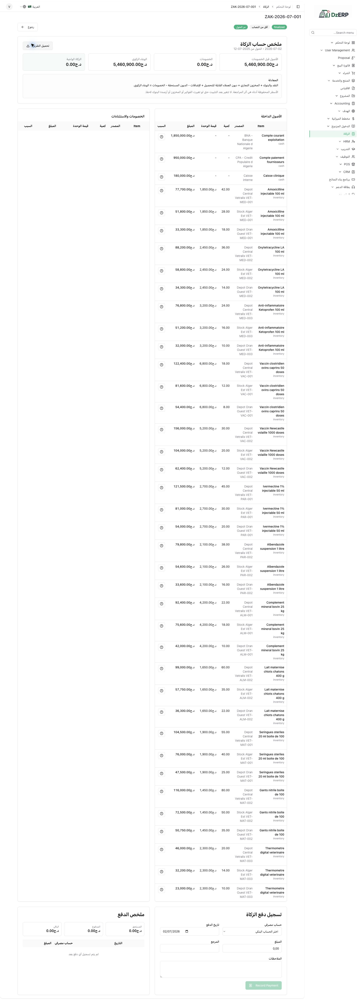
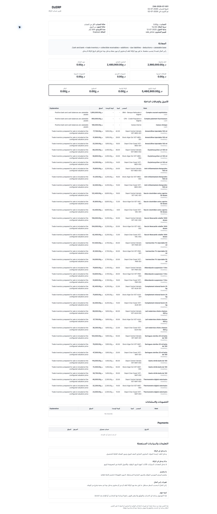

# Zakat Screenshots

تم التقاط هذه الصور من موديول الزكاة بعد تفعيله على حساب الشركة المحلي.

## 1. شاشة الزكاة الرئيسية

تعرض المعاينة الحالية، الشروحات والتعليمات، إعدادات الزكاة، ونموذج إنشاء الحساب.

## 2. تفاصيل حساب الزكاة

تعرض ملخص الوعاء الزكوي، الأصول الداخلة، الخصومات والاستثناءات قبل التثبيت.

## 3. الحساب بعد التثبيت

تعرض حالة الحساب بعد `Finalize` مع زر تحميل التقرير ونموذج تسجيل الدفع.

## 4. تقرير الزكاة

يعرض التقرير الثابت المبني على snapshot وقت التثبيت، مع المعادلة، الجداول، التعليلات، والتعليمات.

